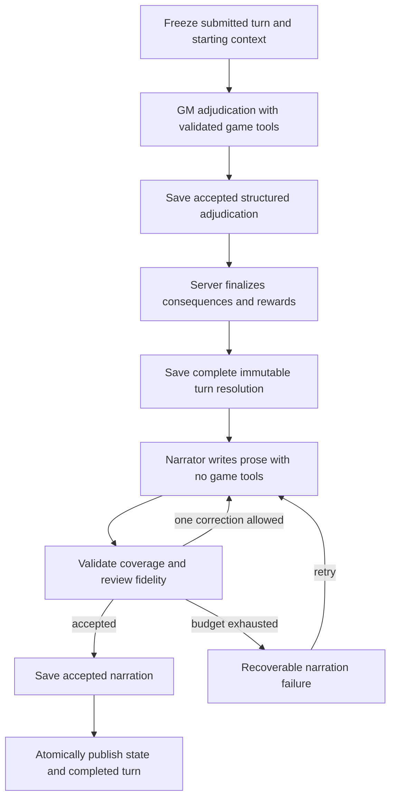

# Separate turn resolution from narration

Status: implemented, 5 October 2026. New turns use the separated pipeline with version-2 action components and event dependencies. Existing started legacy drafts keep their compatibility route; completed saves are preserved. The five review findings, checkpoint recovery and live acceptance results are documented in [TURN_RESOLUTION_REPAIR_PLAN.md](TURN_RESOLUTION_REPAIR_PLAN.md). All four user-approved isolated live ChatGPT scenarios passed, using 21 model requests in total.

Implementation: `shared/turn-resolution.ts` defines strict contracts and reference/coverage validation; `server/turn-resolution.ts` adapts authoritative receipts; `server/turn-recovery.ts` repairs provable saved facts; `Game.finalize()` saves consequences and rewards; `Game.publish()` atomically publishes saved state. ChatGPT adjudication has tools, narration and fidelity review do not. Combat emits typed metadata alongside existing logs. The existing SQLite draft stores all checkpoints, without a database schema migration. Finalized character HP, conditions, ability uses and progression are included in resolution for review.

Automated acceptance is in `tests/turn-resolution.test.ts` plus the existing engine/provider/persistence suites. The practice provider exercises the same checkpoint pipeline deterministically. Tests simulate interrupted finalization, narration and publication and restart from saved checkpoints; they do not call the live paid model.

## Decision

The Seaworld follow-up adds version-2 narration with `{eventIds, text}` passages. A passage can cover a receipt, its fictional outcome and related world restatements together. Coverage remains exact, and causal dependencies plus engine/combat order remain validated. Version-1 narration checkpoints retain their existing reader. Publication uses a shared paragraph renderer; factual review also rejects repeated action tellings and recap-only closings.

Noncombat helper checks may declare `assistsMemberId`. A dependent check names successful earlier helpers in `assistedBy`, and the engine applies advantage once or cancels disadvantage. Self, duplicate, unrelated, failed and late assistance is rejected before rolling. The resulting engine event depends on the helper check's success. Routine assistance may remove the need for a dependent roll. Adjudication guidance uses factual history and journal to preserve preparation and establish proportionate new consequences of repeated failure. Regressions are in `tests/playtest-followup.test.ts`.

Adopt one turn pipeline for exploration, combat, support actions, and opening scenes. The GM adjudicates the fiction, the server executes and finalizes mechanics, and a separate narrator describes a persisted result. A narration failure must never reopen gameplay decisions.



The diagram's correction edge is bounded: at most two narrator requests and two review requests per attempt. A retry after a publishing failure resumes from the saved narration instead of entering the narrator again.

## What this fixes

Routine actions currently have no independent outcome record: `narrationBeats()` falls back to the submitted prompt. The repair and review steps then use generated closing prose and summary to infer what happened. That makes presentation part of adjudication.

The new resolver records both the attempted action and its outcome. For the reported example, it records that Amon-Sah's hand unlocks the closure, then that Zafir opens the unlocked door. The narrator describes those facts; it does not decide whether either action succeeded.

A second problem is timing. `Game.commit()` currently still draws environmental impact dice, applies damage and conditions, ticks noncombat ailments, grants XP/gold, and changes location. Those operations must happen in finalization before the narrator runs. Otherwise the narrator receives an incomplete result.

## Authority and stage contracts

| Component | Owns | Output |
| --- | --- | --- |
| GM adjudicator | Interpretation within submitted intent; routine outcomes; check necessity; world discoveries and NPC responses; contextual critical consequences; proposed world changes and rewards | Structured adjudication and existing tool requests |
| Rules engine and finalizer | Dice, numerical state, action budgets, ability/item usage, combat, downing/death, recovery, condition ticks, validated rewards | Final turn resolution and resulting draft state |
| Narrator | Wording, sensory description, dialogue already established by resolution, readable recap | Event paragraphs, closing prose, situation summary |
| Fidelity reviewer | Whether all presentation agrees with finalized facts | Approval/rejection with specific corrections needed |
| Publisher | Durable state/history/journal writes and the next-turn transition | Completed turn and next roster |

Only adjudication may establish a new clue, NPC decision, revealed secret, loot discovery, location, public journal fact, or safe-rest permission. Narration can enrich its description but cannot establish another fact. The situation summary is presentation too.

Use three strict, versioned contracts:

1. **`TurnAdjudication`**: turn identity, one interpretation/disposition proposal per submitted action, references to existing receipts, any pending combat plan, routine outcome facts and reasons, causal ordering, supported state-change proposals, world/journal changes, and reward proposals with reasons. Checked and engine-driven results must agree with receipts; the model cannot set their dice or numerical outcomes.
2. **`TurnResolution`**: server-validated action outcomes, ordered resolved events, receipt references, canonical resulting world facts, a factual recap, and actual per-recipient reward receipts. It includes the finalized character mechanics; its accompanying draft contains full finalized member and scene state. This is the narrator's sole source of truth.
3. **`TurnNarration`**: paragraphs keyed by exact resolved-event IDs, closing prose, and a situation summary. Reject mechanics, reward, journal, location, inventory, and rest-state fields in this response.

Retain the current `Outcome` as the public completed-turn format initially. The server builds it from resolution plus narration; no LLM returns the entire authoritative object anymore.

### Action outcomes and event ordering

Every submitted action gets exactly one aggregate outcome, including passes, blocked actions, interrupted actions, and routine acts without dice. An aggregate can reference multiple events for main/minor effects and combat consequences.

Version 2 records main and minor components explicitly and derives the aggregate from them. Saved execution receipts establish the relevant component even when starting or finalized capability differs. Dependencies declare either an earlier event's occurrence or its specific successful result; an aggregate partial result cannot stand in for a failed prerequisite. Version-1 accepted checkpoints retain their original contract when resuming.

Start with:

- Status: `success`, `failure`, `partial`, `blocked`, or `passed`.
- Basis: `routine`, `check`, `engine`, or `none`.
- Stable action identity derived from turn/member IDs, with the original character identity/name saved for history.
- An outcome fact and adjudication reason; receipt references for any mechanical effects.
- References to the ordered events describing that action.

Each event has a stable ID, sequence, kind, optional actor/action identity, outcome facts, and receipt references. Add backward event dependencies only where causal linkage matters. Arrays and reference validation are sufficient; no workflow framework, event bus, or world graph is needed.

For the door example:

| Event | Outcome | Basis | Dependency |
| --- | --- | --- | --- |
| Amon's action | His hand activates and unlocks the closure | Routine, with an established-fiction reason | None |
| Zafir's action | He opens the now-unlocked door | Routine | Amon's unlocking event |
| Scene discovery | The sanctuary and its specified clues become visible | GM world adjudication | The opened door |

Both action records explicitly have zero check receipts. Discovery XP cites the new sanctuary/clues, not the act of rolling dice. If unlocking fails, Zafir's dependent result must reflect that; another successful approach requires its own supported adjudication.

Preserve existing combat initiative/event order. Emit typed actor/action/receipt metadata where the combat engine currently creates log lines; retain text logs for compatibility. Do not reconstruct authoritative outcomes by parsing names or numbers from prose, or regroup all combat events by actor.

## Durable checkpoints and retries

Extend the existing `turns.draft` JSON with versioned optional checkpoints:

```ts
type TurnDraft = {
  pipelineVersion: 1;
  members: Member[];
  scene: Scene;
  receipts: ExistingReceipts;
  adjudication?: TurnAdjudication;
  resolution?: TurnResolution;
  narration?: TurnNarration;
};
```

These contracts are implemented in the shared resolution module. The draft also stores frozen context and starting member state. Keep existing public turn phases. The highest valid checkpoint determines the next internal stage; a separate persisted stage enum is unnecessary.

| Saved checkpoint | Resume behavior |
| --- | --- |
| Starting draft / partial tools | Continue adjudication with saved immutable dice and tool receipts |
| Accepted adjudication | Replay that exact adjudication through finalization; no new interpretation |
| Final resolution | Run narration/review only; no game tools or new dice preparation |
| Accepted narration | Publish only; no LLM request |
| Completed turn | Return saved history; no replay |

Persist adjudication before finalization. Environmental damage can draw dice and then fail; retrying a different adjudication could otherwise conflict with locked dice parameters. Reuse existing receipt idempotency and transactional rollback behavior rather than introducing another dice mechanism.

Finalization computes all remaining effects against the draft, validates them, and saves finalized state and resolution together. It never publishes half of a turn. Once resolution exists, all gameplay-tool entry points reject further mutations for that turn. Narration/review have no tools in either their interface or provider request.

Publishing writes the already-finalized mechanical state, canonical world/journal updates, and assembled presentation in one transaction. It must not draw dice, tick conditions, decide rewards, or derive outcomes from prose. Commit interruption rolls back publication; the saved resolution and narration remain reusable. Effects and rewards therefore appear once.

### Concurrent player controls

Freeze the roster, starting member/scene snapshots, and relevant campaign configuration synchronously when the worker claims the turn, before the first await. A late join must not enter the current draft merely because the model took time to respond.

Keep current collecting-only locks for action edits, equipment, self-healing, rest, loot, and level-ups through narration and failed turns. Preserve the controls already allowed during processing:

- Sit-out changes affect next-turn participation, not frozen current actions.
- Late joins retain their new rows and enter the next roster without current-turn actions or rewards.
- Replacement queue changes/cancellation remain allowed. Publication reads the latest selection, activates eligible replacements for the next turn, and records next-turn arrival events.

Never overwrite live participation/replacement metadata with a frozen mechanical snapshot. Preserve the completed turn's old actor identities before activating replacements. Build the next roster using the existing live-membership transition. Do not use a blanket campaign-version equality check, because allowed metadata changes can advance that version during narration.

## Continuity, rewards, and narration validation

New turns consume saved resolution facts/factual recaps and canonical journal updates. They must not learn new world facts from narrator-generated summaries or closing descriptions. Legacy completed turns can still supply their existing summaries, explicitly as legacy context.

Preserve gameplay rules: risky or uncertain actions require checks; ordinary supported actions may succeed without checks; selected utility abilities still require their saved check and charge; meaningful discoveries may earn XP without dice; each failed action remains a failure even when it reveals useful information. Keep current reward limits and encounter recovery rules. Finalization saves actual per-recipient XP/gold changes; the server appends their display text to the situation summary once.

Deterministic validation checks exact action coverage, known and unique event IDs, nonempty outcome facts, valid actors/receipt references, statuses matching engine receipts, backward dependencies and prerequisite consistency, supported mutations, action budgets, and complete narration within the existing length limit. Missing events must cause correction or a recoverable failure, never a copied-prompt fallback. Raw inputs remain visible in submissions and expanded roll details.

Local validation cannot prove the semantic truth of all free-form fiction. Keep the tools-disabled fidelity reviewer enabled during the initial rollout. It receives only the frozen resolution and candidate presentation, and reviews event paragraphs, closing prose, and summary. Candidate prose must never serve as evidence that an action succeeded.

Use a flat narration budget: one narrator request and one review normally; at most one narrator correction and its matching review. Invalid JSON and rejected prose consume that same budget. Remove nested generic retry loops and the current three-attempt prose repair path for this pipeline. After exhaustion, save a stage-specific failure and allow deliberate retry from the resolution checkpoint.

Use hard adjudication limits of eight model requests and twenty game-tool calls per attempt. Combat planning, malformed-output corrections, and missing-mechanics corrections consume that same stage budget; helpers must not introduce nested request budgets. Existing receipts remain immutable across deliberate retries.

Two stages do not mean exactly two API calls. Exploration resolution may need several tool round trips; combat may need a planning request. With review enabled, a simple no-tool turn normally uses one adjudication request, one narration request, and one review. A narration correction adds at most two calls. Record stage, attempt count, duration, and failure category in existing turn events; do not log credentials or create a separate telemetry service.

## Implementation sequence

### 1. Define contracts and fixtures

Add a focused shared resolution-schema module. Define the three contracts, action/event identities, ordering, dependencies, and versioning. Build strict validators and the door/recess fixture. Document the numerical-versus-fiction authority boundary in provider prompts.

Acceptance: missing/duplicate actors, invalid receipt references, contradictory engine statuses, forward dependencies, and mutation fields in narrator output are rejected.

### 2. Extract finalization from publication

Refactor `Game.commit()` into draft finalization and atomic publication, initially using the existing provider result as an adapter. Move environmental impact dice, damage, condition changes/ticks, XP/gold, location/rest state, and canonical journal handling upstream. Save accepted adjudication before these operations and finalized resolution afterward. Preserve replacement activation as next-turn lifecycle handling during publication.

Acceptance: interruption at every boundary resumes correctly; publication contains no gameplay randomness or gameplay resolution. Generating next-turn and inventory identifiers remains allowed. Compare final mechanical state to existing fixtures without executing old and new engines twice on live turns.

### 3. Separate provider methods

Replace combined `resolve(context, tools)` with typed adjudication and tools-disabled narration methods. Reuse existing combat planning/execution and tool receipts; adapt combat/support results into the common resolution. Make the practice provider produce the same contracts deterministically. Keep character generation and level-up generation unchanged.

Acceptance: the resolver cannot return presentation as authoritative outcomes; the narrator cannot mutate game/world state. Every action, including no-roll actions, has a recorded result before narration begins.

### 4. Ground rendering and review in resolution

Build narration events from typed outcomes/receipts instead of submitted-text fallbacks. Narrate required IDs in frozen order, validate coverage/budget, review all presentation against resolution, and apply the flat retry budget. Feed future adjudication the factual recap. Keep the existing roll accordion and shared/player views.

Acceptance: the reported door turn has explicit causal outcomes, no dice, justified XP once, no copied prompts, and matching narration/summary/journal facts. A narration-only retry cannot call the resolver or finalizer.

### 5. Make recovery and compatibility safe

Test and expose stage-specific failures through the existing retry UI. Preserve completed saves and exports. Add checkpoints without requiring a new table; bump the database version only if implementation identifies a necessary SQL schema change.

Treat a missing `pipelineVersion` as legacy version 0. Choose and persist the route before any provider request: fresh turns and collecting turns with no executed mechanics enter version 1; already-started legacy turns keep version 0 unless a complete, validated receipt adapter can atomically promote their draft to version 1 first. Persist the decision alongside the frozen draft without dropping old fields. Retries/restarts honor that marker and cannot switch paths implicitly.

Preserve legacy pending drafts and receipts. Completed combat/resource receipts can be adapted directly, and incomplete combat replays its saved plan and dice. Never reconstruct a missing routine outcome from old narration. Retain a narrow legacy-completion path for already-started turns that cannot safely be adapted. If a legacy failed draft lacks the adjudication needed to replay a locked environmental receipt, fail recoverably with the receipt preserved and an explicit compatibility error; the old worker cannot recover facts that were never saved. Never invent or reroll them, and never run both paths for one turn.

Acceptance: existing campaigns continue without resetting dice, resources, XP, characters, or history. Restart recovery remains deliberate retry. Compatibility code is isolated from the new pipeline.

### 6. Verify the cutover and remove superseded paths

Run targeted provider, narration, game, combat, replacement, persistence, and browser checks, then playtest a two-player exploration turn, a dependent-action failure, combat, and a narrator failure/retry. Inspect stage call counts. Update `PLAN.md`, `README.md`, and the gameplay software contract to describe implemented behavior. Remove the combined outcome/repair path from the new pipeline and retire legacy completion support when no active turns require it.

Acceptance: no gameplay regressions, all critical checks below pass, and observed call counts match the documented budgets.

## Critical acceptance checks

1. Door/recess successes: correct dependency/order; zero rolls; narrated outcomes; discovery XP exactly once.
2. Failed prerequisite and routine failure: downstream action cannot silently succeed.
3. Checked failure with discovery XP: failure stays explicit while meaningful progress can still be rewarded.
4. Utility ability, consumable, Mend/Cleanse, support, pass, incapacitation, and interrupted action: complete coverage with preserved receipts and action budgets.
5. Environmental finalization interruption: exact saved proposal and dice reused; no partial state publication.
6. Ailment ticks, recovery, natural critical consequences, Downed/dead state, rewards, and location facts: finalized before narration and applied once.
7. Narration failure plus host restart: resolver/finalizer are not called again; routine outcomes are not reinterpreted.
8. Publication failure after saved narration: no additional LLM call; history, state, journal, and rewards appear once.
9. Narrator/reviewer tool calls or mutation fields: ignored/rejected without executing mechanics; hallucinated outcomes/clues in paragraphs, closing, or summary are rejected.
10. Budget pressure: every required outcome is narrated or the stage fails recoverably; later actors are never replaced with raw prompts.
11. Combat initiative, misses, retargeting, main/minor effects, withdrawal, and permanent death: typed events preserve existing execution order and facts.
12. Late join, sit-out, and replacement changes while narration waits: preserved for the correct turn without overwriting live metadata.
13. Opening scene and next-turn replacement arrivals: use the same separation, with no invented player actions or premature arrivals.
14. Legacy save, partial combat receipt, and consumed-resource recovery: old history remains readable and no locked mechanics are reset.

Use the existing test harnesses. The provider door regression, game retry/restart tests, combat receipt tests, replacement tests, and narration order/budget tests are the starting points.

## Boundaries for future features

A new gameplay feature adds a validated adjudication/tool capability, server execution and receipts, typed outcome events, and contract tests. The narrator consumes those facts without gaining another mutation capability. Presentation can be regenerated from a saved resolution without changing gameplay. Per-stage model selection or asynchronous narration can be added later at these boundaries if needed; they are not required for this implementation.

The first implementation deliberately keeps SQLite, the existing worker, existing public turn phases, current gameplay rules, and one campaign turn at a time. Its extensibility comes from explicit contracts and durable checkpoints rather than new infrastructure.
